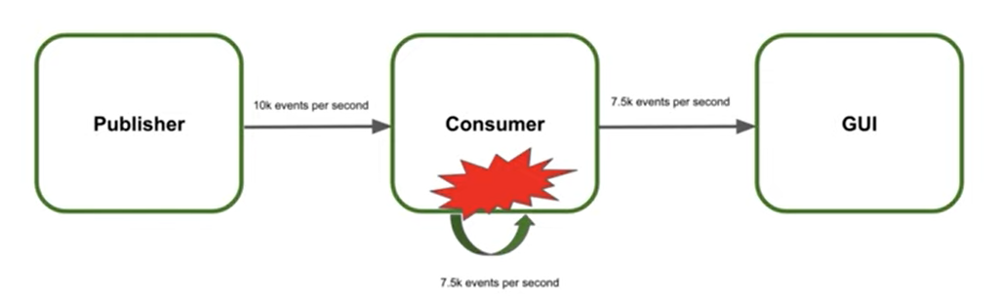

# Backpressure

Backpressure stratgies help to keep the server stable, scalable.

*Not all elements are processed!*



## 01 No overflow

```java
@Slf4j
public class BackpressureTutorial {

    private Flux<Long> createNoOverflowFlux() {
        return Flux.range(1, Integer.MAX_VALUE)
                .log()
                .concatMap(x -> Mono.delay(Duration.ofMillis(100))); // simulate that processing takes time
    }

    public static void main(String[] args) {
        BackpressureTutorial tutorial = new BackpressureTutorial();

        log.info("01 No overflow")
        tutorial
                .createNoOverflowFlux()
                .blockLast();

    }
}
```

Output
```text
10:15:52: Executing ':com.bsoft.reactive.BackpressureTutorial.main()'…

> Task :generateEffectiveLombokConfig UP-TO-DATE
> Task :compileJava
> Task :processResources UP-TO-DATE
> Task :classes

> Task :com.bsoft.reactive.BackpressureTutorial.main()
10:16:04.553 [main] INFO reactor.Flux.Range.1 -- | onSubscribe([Synchronous Fuseable] FluxRange.RangeSubscription)
10:16:04.558 [main] INFO reactor.Flux.Range.1 -- | request(1)
10:16:04.558 [main] INFO reactor.Flux.Range.1 -- | onNext(1)
10:16:04.701 [parallel-1] INFO reactor.Flux.Range.1 -- | request(1)
10:16:04.701 [parallel-1] INFO reactor.Flux.Range.1 -- | onNext(2)
10:16:04.806 [parallel-2] INFO reactor.Flux.Range.1 -- | request(1)
10:16:04.806 [parallel-2] INFO reactor.Flux.Range.1 -- | onNext(3)
10:16:04.914 [parallel-3] INFO reactor.Flux.Range.1 -- | request(1)
10:16:04.914 [parallel-3] INFO reactor.Flux.Range.1 -- | onNext(4)
10:16:05.024 [parallel-4] INFO reactor.Flux.Range.1 -- | request(1)
10:16:05.024 [parallel-4] INFO reactor.Flux.Range.1 -- | onNext(5)
```

## 02 Overflow

```java
@Slf4j
public class BackpressureTutorial {

    private Flux<Long> createOverflowFlux() {
        return Flux.interval(Duration.ofMillis(1)) // every 1 ms a value is added to the flux
                .log()
                .concatMap(x -> Mono.delay(Duration.ofMillis(100))); // simulate that processing takes 100ms
    }

    public static void main(String[] args) {
        BackpressureTutorial tutorial = new BackpressureTutorial();

        log.info("02 Overflow");
        tutorial
                .createOverflowFlux()
                .blockLast();
    }
}

```

```text
10:24:25: Executing ':com.bsoft.reactive.BackpressureTutorial.main()'…

> Task :generateEffectiveLombokConfig UP-TO-DATE
> Task :compileJava
> Task :processResources UP-TO-DATE
> Task :classes

> Task :com.bsoft.reactive.BackpressureTutorial.main() FAILED
10:24:28.637 [main] INFO com.bsoft.reactive.BackpressureTutorial -- 02 Overflow
10:24:28.788 [main] INFO reactor.Flux.Interval.1 -- onSubscribe(FluxInterval.IntervalRunnable)
10:24:28.790 [main] INFO reactor.Flux.Interval.1 -- request(1)
10:24:28.808 [parallel-1] INFO reactor.Flux.Interval.1 -- onNext(0)
10:24:28.819 [parallel-1] ERROR reactor.Flux.Interval.1 -- onError(reactor.core.Exceptions$OverflowException: Could not emit tick 1 due to lack of requests (interval doesn't support small downstream requests that replenish slower than the ticks))
10:24:28.820 [parallel-1] ERROR reactor.Flux.Interval.1 -- 
reactor.core.Exceptions$OverflowException: Could not emit tick 1 due to lack of requests (interval doesn't support small downstream requests that replenish slower than the ticks)
	at reactor.core.Exceptions.failWithOverflow(Exceptions.java:251)
	at reactor.core.publisher.FluxInterval$IntervalRunnable.run(FluxInterval.java:131)
	at reactor.core.scheduler.PeriodicWorkerTask.call(PeriodicWorkerTask.java:59)
	at reactor.core.scheduler.PeriodicWorkerTask.run(PeriodicWorkerTask.java:73)
	at java.base/java.util.concurrent.Executors$RunnableAdapter.call(Executors.java:572)
	at java.base/java.util.concurrent.FutureTask.runAndReset(FutureTask.java:358)
	at java.base/java.util.concurrent.ScheduledThreadPoolExecutor$ScheduledFutureTask.run(ScheduledThreadPoolExecutor.java:305)
	at java.base/java.util.concurrent.ThreadPoolExecutor.runWorker(ThreadPoolExecutor.java:1144)
	at java.base/java.util.concurrent.ThreadPoolExecutor$Worker.run(ThreadPoolExecutor.java:642)
	at java.base/java.lang.Thread.run(Thread.java:1583)
4 actionable tasks: 2 executed, 2 up-to-date
Exception in thread "main" reactor.core.Exceptions$OverflowException: Could not emit tick 1 due to lack of requests (interval doesn't support small downstream requests that replenish slower than the ticks)
	at reactor.core.Exceptions.failWithOverflow(Exceptions.java:251)
	at reactor.core.publisher.FluxInterval$IntervalRunnable.run(FluxInterval.java:131)
	at reactor.core.scheduler.PeriodicWorkerTask.call(PeriodicWorkerTask.java:59)
	at reactor.core.scheduler.PeriodicWorkerTask.run(PeriodicWorkerTask.java:73)
	at java.base/java.util.concurrent.Executors$RunnableAdapter.call(Executors.java:572)
	at java.base/java.util.concurrent.FutureTask.runAndReset(FutureTask.java:358)
	at java.base/java.util.concurrent.ScheduledThreadPoolExecutor$ScheduledFutureTask.run(ScheduledThreadPoolExecutor.java:305)
	at java.base/java.util.concurrent.ThreadPoolExecutor.runWorker(ThreadPoolExecutor.java:1144)
	at java.base/java.util.concurrent.ThreadPoolExecutor$Worker.run(ThreadPoolExecutor.java:642)
	at java.base/java.lang.Thread.run(Thread.java:1583)
	Suppressed: java.lang.Exception: #block terminated with an error
		at reactor.core.publisher.BlockingSingleSubscriber.blockingGet(BlockingSingleSubscriber.java:104)
		at reactor.core.publisher.Flux.blockLast(Flux.java:2817)
		at com.bsoft.reactive.BackpressureTutorial.main(BackpressureTutorial.java:35)

FAILURE: Build failed with an exception.

* What went wrong:
Execution failed for task ':com.bsoft.reactive.BackpressureTutorial.main()'.
```

## 03 Drop elements on backpressure

```java
@Slf4j
public class BackpressureTutorial {

    /*
    In order to prevent backpressure drop elements
     */
    private Flux<Long> createDropOnBackpressureFlux() {
        return Flux.interval(Duration.ofMillis(1)) // every 1 ms a value is added to the flux
                .onBackpressureDrop()
                .log()
                .concatMap(x -> Mono.delay(Duration.ofMillis(100)).thenReturn(x)) // simulate that processing takes 100ms
                .doOnNext(x -> System.out.println("Element kept by consumer: " + x));
    }


    public static void main(String[] args) {
        BackpressureTutorial tutorial = new BackpressureTutorial();

        log.info("03 Drop elements on backpressure");
        tutorial
                .createDropOnBackpressureFlux()
                .blockLast();
    }
}
```

Output

```text
10:32:10: Executing ':com.bsoft.reactive.BackpressureTutorial.main()'…

> Task :generateEffectiveLombokConfig UP-TO-DATE
> Task :compileJava
> Task :processResources UP-TO-DATE
> Task :classes

> Task :com.bsoft.reactive.BackpressureTutorial.main()
10:32:21.045 [main] INFO com.bsoft.reactive.BackpressureTutorial -- 03 Drop elements on backpressure
10:32:21.243 [main] INFO reactor.Flux.OnBackpressureDrop.1 -- onSubscribe(FluxOnBackpressureDrop.DropSubscriber)
10:32:21.245 [main] INFO reactor.Flux.OnBackpressureDrop.1 -- request(1)
10:32:21.261 [parallel-1] INFO reactor.Flux.OnBackpressureDrop.1 -- onNext(0)
Element kept by consumer: 0
10:32:21.379 [parallel-2] INFO reactor.Flux.OnBackpressureDrop.1 -- request(1)
10:32:21.383 [parallel-1] INFO reactor.Flux.OnBackpressureDrop.1 -- onNext(130)
Element kept by consumer: 130
10:32:21.500 [parallel-3] INFO reactor.Flux.OnBackpressureDrop.1 -- request(1)
10:32:21.501 [parallel-1] INFO reactor.Flux.OnBackpressureDrop.1 -- onNext(251)
Element kept by consumer: 251
10:32:21.614 [parallel-4] INFO reactor.Flux.OnBackpressureDrop.1 -- request(1)
10:32:21.629 [parallel-1] INFO reactor.Flux.OnBackpressureDrop.1 -- onNext(366)
Element kept by consumer: 366
10:32:21.730 [parallel-5] INFO reactor.Flux.OnBackpressureDrop.1 -- request(1)
10:32:21.746 [parallel-1] INFO reactor.Flux.OnBackpressureDrop.1 -- onNext(482)
Element kept by consumer: 482
10:32:21.860 [parallel-6] INFO reactor.Flux.OnBackpressureDrop.1 -- request(1)
10:32:21.875 [parallel-1] INFO reactor.Flux.OnBackpressureDrop.1 -- onNext(612)
Element kept by consumer: 612
10:32:21.975 [parallel-7] INFO reactor.Flux.OnBackpressureDrop.1 -- request(1)
10:32:21.984 [parallel-1] INFO reactor.Flux.OnBackpressureDrop.1 -- onNext(727)
Element kept by consumer727
```

## 04 Buffer elements on backpressure
Buffer size to small. Since each millisecond an entry is created.
Increasing buffer size only helps for a while, since the production is greater than then consumption of elements.

```java
@Slf4j
public class BackpressureTutorial {

    /*
    In order to prevent backpressure store the elements in a buffer
     */
    private Flux<Long> createBufferOnBackpressureFlux() {
        return Flux.interval(Duration.ofMillis(1)) // every 1 ms a value is added to the flux
                .onBackpressureBuffer(50)  // will not be big enough
                .log()
                .concatMap(x -> Mono.delay(Duration.ofMillis(100)).thenReturn(x)) // simulate that processing takes 100ms
                .doOnNext(x -> System.out.println("Element kept by consumer: " + x));
    }

    public static void main(String[] args) {
        BackpressureTutorial tutorial = new BackpressureTutorial();

        log.info("04 Buffer elements on backpressure");
        tutorial
                .createBufferOnBackpressureFlux()
                .blockLast();
    }

}

```

Output

```text
10:48:04: Executing ':com.bsoft.reactive.BackpressureTutorial.main()'…

> Task :generateEffectiveLombokConfig UP-TO-DATE
> Task :compileJava
> Task :processResources UP-TO-DATE
> Task :classes

> Task :com.bsoft.reactive.BackpressureTutorial.main()
10:48:13.975 [main] INFO com.bsoft.reactive.BackpressureTutorial -- 04 Buffer elements on backpressure
10:48:14.143 [main] INFO reactor.Flux.OnBackpressureBuffer.1 -- | onSubscribe([Fuseable] FluxOnBackpressureBuffer.BackpressureBufferSubscriber)
10:48:14.146 [main] INFO reactor.Flux.OnBackpressureBuffer.1 -- | request(1)
10:48:14.154 [parallel-1] INFO reactor.Flux.OnBackpressureBuffer.1 -- | onNext(0)
Element kept by consumer: 0
10:48:14.270 [parallel-2] INFO reactor.Flux.OnBackpressureBuffer.1 -- | request(1)
10:48:14.271 [parallel-2] INFO reactor.Flux.OnBackpressureBuffer.1 -- | onNext(1)
Element kept by consumer: 1
10:48:14.386 [parallel-3] INFO reactor.Flux.OnBackpressureBuffer.1 -- | request(1)
10:48:14.386 [parallel-3] INFO reactor.Flux.OnBackpressureBuffer.1 -- | onNext(2)
Element kept by consumer: 2
10:48:14.493 [parallel-4] INFO reactor.Flux.OnBackpressureBuffer.1 -- | request(1)
10:48:14.493 [parallel-4] INFO reactor.Flux.OnBackpressureBuffer.1 -- | onNext(3)
Element kept by consumer: 3
10:48:14.608 [parallel-5] INFO reactor.Flux.OnBackpressureBuffer.1 -- | request(1)
10:48:14.608 [parallel-5] INFO reactor.Flux.OnBackpressureBuffer.1 -- | onNext(4)
Element kept by consumer: 4
10:48:14.724 [parallel-6] INFO reactor.Flux.OnBackpressureBuffer.1 -- | request(1)
10:48:14.724 [parallel-6] INFO reactor.Flux.OnBackpressureBuffer.1 -- | onNext(5)
Element kept by consumer: 5
10:48:14.838 [parallel-7] INFO reactor.Flux.OnBackpressureBuffer.1 -- | request(1)
10:48:14.838 [parallel-7] INFO reactor.Flux.OnBackpressureBuffer.1 -- | onNext(6)
Element kept by consumer: 6
10:48:14.953 [parallel-8] INFO reactor.Flux.OnBackpressureBuffer.1 -- | request(1)
10:48:14.953 [parallel-8] INFO reactor.Flux.OnBackpressureBuffer.1 -- | onNext(7)
Element kept by consumer: 7
10:48:15.068 [parallel-9] INFO reactor.Flux.OnBackpressureBuffer.1 -- | request(1)
10:48:15.068 [parallel-9] INFO reactor.Flux.OnBackpressureBuffer.1 -- | onNext(8)
Element kept by consumer: 8
10:48:15.174 [parallel-10] INFO reactor.Flux.OnBackpressureBuffer.1 -- | request(1)
10:48:15.174 [parallel-10] INFO reactor.Flux.OnBackpressureBuffer.1 -- | onNext(9)
Element kept by consumer: 9
10:48:15.283 [parallel-11] INFO reactor.Flux.OnBackpressureBuffer.1 -- | request(1)
10:48:15.283 [parallel-11] INFO reactor.Flux.OnBackpressureBuffer.1 -- | onNext(10)
Element kept by consumer: 10
10:48:15.392 [parallel-12] INFO reactor.Flux.OnBackpressureBuffer.1 -- | request(1)
10:48:15.392 [parallel-12] INFO reactor.Flux.OnBackpressureBuffer.1 -- | onNext(11)
Element kept by consumer: 11
10:48:15.507 [parallel-1] INFO reactor.Flux.OnBackpressureBuffer.1 -- | request(1)
10:48:15.507 [parallel-1] INFO reactor.Flux.OnBackpressureBuffer.1 -- | onNext(12)
Element kept by consumer: 12
10:48:15.616 [parallel-2] INFO reactor.Flux.OnBackpressureBuffer.1 -- | request(1)
10:48:15.616 [parallel-2] INFO reactor.Flux.OnBackpressureBuffer.1 -- | onNext(13)
Element kept by consumer: 13
10:48:15.722 [parallel-3] INFO reactor.Flux.OnBackpressureBuffer.1 -- | request(1)
10:48:15.722 [parallel-3] INFO reactor.Flux.OnBackpressureBuffer.1 -- | onNext(14)
Element kept by consumer: 14
10:48:15.832 [parallel-4] INFO reactor.Flux.OnBackpressureBuffer.1 -- | request(1)
10:48:15.832 [parallel-4] INFO reactor.Flux.OnBackpressureBuffer.1 -- | onNext(15)
Element kept by consumer: 15
10:48:15.938 [parallel-5] INFO reactor.Flux.OnBackpressureBuffer.1 -- | request(1)
10:48:15.938 [parallel-5] INFO reactor.Flux.OnBackpressureBuffer.1 -- | onNext(16)
Element kept by consumer: 16
10:48:16.039 [parallel-6] INFO reactor.Flux.OnBackpressureBuffer.1 -- | request(1)
10:48:16.039 [parallel-6] INFO reactor.Flux.OnBackpressureBuffer.1 -- | onNext(17)
Element kept by consumer: 17
10:48:16.153 [parallel-7] INFO reactor.Flux.OnBackpressureBuffer.1 -- | request(1)
10:48:16.153 [parallel-7] INFO reactor.Flux.OnBackpressureBuffer.1 -- | onNext(18)
Element kept by consumer: 18
10:48:16.262 [parallel-8] INFO reactor.Flux.OnBackpressureBuffer.1 -- | request(1)
10:48:16.262 [parallel-8] INFO reactor.Flux.OnBackpressureBuffer.1 -- | onNext(19)
Element kept by consumer: 19
10:48:16.369 [parallel-9] INFO reactor.Flux.OnBackpressureBuffer.1 -- | request(1)
10:48:16.369 [parallel-9] INFO reactor.Flux.OnBackpressureBuffer.1 -- | onNext(20)
Element kept by consumer: 20
10:48:16.471 [parallel-10] INFO reactor.Flux.OnBackpressureBuffer.1 -- | request(1)
10:48:16.471 [parallel-10] INFO reactor.Flux.OnBackpressureBuffer.1 -- | onNext(21)
Element kept by consumer: 21
10:48:16.585 [parallel-11] INFO reactor.Flux.OnBackpressureBuffer.1 -- | request(1)
10:48:16.585 [parallel-11] INFO reactor.Flux.OnBackpressureBuffer.1 -- | onNext(22)
Element kept by consumer: 22
10:48:16.692 [parallel-12] INFO reactor.Flux.OnBackpressureBuffer.1 -- | request(1)
10:48:16.692 [parallel-12] INFO reactor.Flux.OnBackpressureBuffer.1 -- | onNext(23)
Element kept by consumer: 23
10:48:16.807 [parallel-1] INFO reactor.Flux.OnBackpressureBuffer.1 -- | request(1)
10:48:16.807 [parallel-1] INFO reactor.Flux.OnBackpressureBuffer.1 -- | onNext(24)
Element kept by consumer: 24
10:48:16.923 [parallel-2] INFO reactor.Flux.OnBackpressureBuffer.1 -- | request(1)
10:48:16.923 [parallel-2] INFO reactor.Flux.OnBackpressureBuffer.1 -- | onNext(25)
Element kept by consumer: 25
10:48:17.031 [parallel-3] INFO reactor.Flux.OnBackpressureBuffer.1 -- | request(1)
10:48:17.031 [parallel-3] INFO reactor.Flux.OnBackpressureBuffer.1 -- | onNext(26)
Element kept by consumer: 26
10:48:17.137 [parallel-4] INFO reactor.Flux.OnBackpressureBuffer.1 -- | request(1)
10:48:17.137 [parallel-4] INFO reactor.Flux.OnBackpressureBuffer.1 -- | onNext(27)
Element kept by consumer: 27
10:48:17.245 [parallel-5] INFO reactor.Flux.OnBackpressureBuffer.1 -- | request(1)
10:48:17.245 [parallel-5] INFO reactor.Flux.OnBackpressureBuffer.1 -- | onNext(28)
Element kept by consumer: 28
10:48:17.355 [parallel-6] INFO reactor.Flux.OnBackpressureBuffer.1 -- | request(1)
10:48:17.355 [parallel-6] INFO reactor.Flux.OnBackpressureBuffer.1 -- | onNext(29)
Element kept by consumer: 29
10:48:17.469 [parallel-7] INFO reactor.Flux.OnBackpressureBuffer.1 -- | request(1)
10:48:17.469 [parallel-7] INFO reactor.Flux.OnBackpressureBuffer.1 -- | onNext(30)
Element kept by consumer: 30
10:48:17.570 [parallel-8] INFO reactor.Flux.OnBackpressureBuffer.1 -- | request(1)
10:48:17.570 [parallel-8] INFO reactor.Flux.OnBackpressureBuffer.1 -- | onNext(31)
Element kept by consumer: 31
10:48:17.671 [parallel-9] INFO reactor.Flux.OnBackpressureBuffer.1 -- | request(1)
10:48:17.671 [parallel-9] INFO reactor.Flux.OnBackpressureBuffer.1 -- | onNext(32)
Element kept by consumer: 32
10:48:17.777 [parallel-10] INFO reactor.Flux.OnBackpressureBuffer.1 -- | request(1)
10:48:17.777 [parallel-10] INFO reactor.Flux.OnBackpressureBuffer.1 -- | onNext(33)
Element kept by consumer: 33
10:48:17.886 [parallel-11] INFO reactor.Flux.OnBackpressureBuffer.1 -- | request(1)
10:48:17.886 [parallel-11] INFO reactor.Flux.OnBackpressureBuffer.1 -- | onNext(34)
Element kept by consumer: 34
10:48:17.988 [parallel-12] INFO reactor.Flux.OnBackpressureBuffer.1 -- | request(1)
10:48:17.988 [parallel-12] INFO reactor.Flux.OnBackpressureBuffer.1 -- | onNext(35)
Element kept by consumer: 35
10:48:18.100 [parallel-1] INFO reactor.Flux.OnBackpressureBuffer.1 -- | request(1)
10:48:18.100 [parallel-1] INFO reactor.Flux.OnBackpressureBuffer.1 -- | onNext(36)
Element kept by consumer: 36
10:48:18.206 [parallel-2] INFO reactor.Flux.OnBackpressureBuffer.1 -- | request(1)
10:48:18.206 [parallel-2] INFO reactor.Flux.OnBackpressureBuffer.1 -- | onNext(37)
Element kept by consumer: 37
10:48:18.321 [parallel-3] INFO reactor.Flux.OnBackpressureBuffer.1 -- | request(1)
10:48:18.321 [parallel-3] INFO reactor.Flux.OnBackpressureBuffer.1 -- | onNext(38)
Element kept by consumer: 38
10:48:18.422 [parallel-4] INFO reactor.Flux.OnBackpressureBuffer.1 -- | request(1)
10:48:18.422 [parallel-4] INFO reactor.Flux.OnBackpressureBuffer.1 -- | onNext(39)
Element kept by consumer: 39
10:48:18.538 [parallel-5] INFO reactor.Flux.OnBackpressureBuffer.1 -- | request(1)
10:48:18.538 [parallel-5] INFO reactor.Flux.OnBackpressureBuffer.1 -- | onNext(40)
Element kept by consumer: 40
10:48:18.653 [parallel-6] INFO reactor.Flux.OnBackpressureBuffer.1 -- | request(1)
10:48:18.653 [parallel-6] INFO reactor.Flux.OnBackpressureBuffer.1 -- | onNext(41)
Element kept by consumer: 41
10:48:18.768 [parallel-7] INFO reactor.Flux.OnBackpressureBuffer.1 -- | request(1)
10:48:18.769 [parallel-7] INFO reactor.Flux.OnBackpressureBuffer.1 -- | onNext(42)
Element kept by consumer: 42
10:48:18.869 [parallel-8] INFO reactor.Flux.OnBackpressureBuffer.1 -- | request(1)
10:48:18.870 [parallel-8] INFO reactor.Flux.OnBackpressureBuffer.1 -- | onNext(43)
Element kept by consumer: 43
10:48:18.975 [parallel-9] INFO reactor.Flux.OnBackpressureBuffer.1 -- | request(1)
10:48:18.975 [parallel-9] INFO reactor.Flux.OnBackpressureBuffer.1 -- | onNext(44)
Element kept by consumer: 44
10:48:19.085 [parallel-10] INFO reactor.Flux.OnBackpressureBuffer.1 -- | request(1)
10:48:19.085 [parallel-10] INFO reactor.Flux.OnBackpressureBuffer.1 -- | onNext(45)
Element kept by consumer: 45
10:48:19.192 [parallel-11] INFO reactor.Flux.OnBackpressureBuffer.1 -- | request(1)
10:48:19.192 [parallel-11] INFO reactor.Flux.OnBackpressureBuffer.1 -- | onNext(46)
Element kept by consumer: 46
10:48:19.307 [parallel-12] INFO reactor.Flux.OnBackpressureBuffer.1 -- | request(1)
10:48:19.307 [parallel-12] INFO reactor.Flux.OnBackpressureBuffer.1 -- | onNext(47)
Element kept by consumer: 47
10:48:19.422 [parallel-1] INFO reactor.Flux.OnBackpressureBuffer.1 -- | request(1)
10:48:19.422 [parallel-1] INFO reactor.Flux.OnBackpressureBuffer.1 -- | onNext(48)
Element kept by consumer: 48
10:48:19.529 [parallel-2] INFO reactor.Flux.OnBackpressureBuffer.1 -- | request(1)
10:48:19.529 [parallel-2] INFO reactor.Flux.OnBackpressureBuffer.1 -- | onNext(49)
Element kept by consumer: 49
10:48:19.637 [parallel-3] INFO reactor.Flux.OnBackpressureBuffer.1 -- | request(1)
10:48:19.637 [parallel-3] INFO reactor.Flux.OnBackpressureBuffer.1 -- | onNext(50)
10:48:19.638 [parallel-3] ERROR reactor.Flux.OnBackpressureBuffer.1 -- | onError(reactor.core.Exceptions$OverflowException: The receiver is overrun by more signals than expected (bounded queue...))
10:48:19.638 [parallel-3] ERROR reactor.Flux.OnBackpressureBuffer.1 -- 
reactor.core.Exceptions$OverflowException: The receiver is overrun by more signals than expected (bounded queue...)
	at reactor.core.Exceptions.failWithOverflow(Exceptions.java:238)
	at reactor.core.publisher.FluxOnBackpressureBuffer$BackpressureBufferSubscriber.onNext(FluxOnBackpressureBuffer.java:177)
	at reactor.core.publisher.FluxInterval$IntervalRunnable.run(FluxInterval.java:124)
	at reactor.core.scheduler.PeriodicWorkerTask.call(PeriodicWorkerTask.java:59)
	at reactor.core.scheduler.PeriodicWorkerTask.run(PeriodicWorkerTask.java:73)
	at java.base/java.util.concurrent.Executors$RunnableAdapter.call(Executors.java:572)
	at java.base/java.util.concurrent.FutureTask.runAndReset(FutureTask.java:358)
	at java.base/java.util.concurrent.ScheduledThreadPoolExecutor$ScheduledFutureTask.run(ScheduledThreadPoolExecutor.java:305)
	at java.base/java.util.concurrent.ThreadPoolExecutor.runWorker(ThreadPoolExecutor.java:1144)
	at java.base/java.util.concurrent.ThreadPoolExecutor$Worker.run(ThreadPoolExecutor.java:642)
	at java.base/java.lang.Thread.run(Thread.java:1583)

> Task :com.bsoft.reactive.BackpressureTutorial.main() FAILED
4 actionable tasks: 2 executed, 2 up-to-date
Exception in thread "main" reactor.core.Exceptions$OverflowException: The receiver is overrun by more signals than expected (bounded queue...)
	at reactor.core.Exceptions.failWithOverflow(Exceptions.java:238)
	at reactor.core.publisher.FluxOnBackpressureBuffer$BackpressureBufferSubscriber.onNext(FluxOnBackpressureBuffer.java:177)
	at reactor.core.publisher.FluxInterval$IntervalRunnable.run(FluxInterval.java:124)
	at reactor.core.scheduler.PeriodicWorkerTask.call(PeriodicWorkerTask.java:59)
	at reactor.core.scheduler.PeriodicWorkerTask.run(PeriodicWorkerTask.java:73)
	at java.base/java.util.concurrent.Executors$RunnableAdapter.call(Executors.java:572)
	at java.base/java.util.concurrent.FutureTask.runAndReset(FutureTask.java:358)
	at java.base/java.util.concurrent.ScheduledThreadPoolExecutor$ScheduledFutureTask.run(ScheduledThreadPoolExecutor.java:305)
	at java.base/java.util.concurrent.ThreadPoolExecutor.runWorker(ThreadPoolExecutor.java:1144)
	at java.base/java.util.concurrent.ThreadPoolExecutor$Worker.run(ThreadPoolExecutor.java:642)
	at java.base/java.lang.Thread.run(Thread.java:1583)
	Suppressed: java.lang.Exception: #block terminated with an error
		at reactor.core.publisher.BlockingSingleSubscriber.blockingGet(BlockingSingleSubscriber.java:104)
		at reactor.core.publisher.Flux.blockLast(Flux.java:2817)
		at com.bsoft.reactive.BackpressureTutorial.main(BackpressureTutorial.java:67)

FAILURE: Build failed with an exception.

* What went wrong:
Execution failed for task ':com.bsoft.reactive.BackpressureTutorial.main()'.
> Process 'command 'C:\Users\PeltBartvan\.jdks\corretto-21.0.3\bin\java.exe'' finished with non-zero exit value 1

* Try:
> Run with --stacktrace option to get the stack trace.
> Run with --info or --debug option to get more log output.
> Run with --scan to get full insights.
> Get more help at https://help.gradle.org.

BUILD FAILED in 15s
10:48:19: Execution finished ':com.bsoft.reactive.BackpressureTutorial.main()'.
```

## 05 Buffer elements on backpressure with bufferoverflow strategy

```java
@Slf4j
public class BackpressureTutorial {
    
    /*
   In order to prevent backpressure store the elements in a buffer
    */
    private Flux<Long> createBufferStrategyOnBackpressureFlux() {
        return Flux.interval(Duration.ofMillis(1)) // every 1 ms a value is added to the flux
                .onBackpressureBuffer(50, BufferOverflowStrategy.DROP_LATEST)  // will drop the latest element on bufferoverflow
                .log()
                .concatMap(x -> Mono.delay(Duration.ofMillis(100)).thenReturn(x)) // simulate that processing takes 100ms
                .doOnNext(x -> System.out.println("Element kept by consumer: " + x));
    }


    public static void main(String[] args) {
        BackpressureTutorial tutorial = new BackpressureTutorial();

        log.info("05 Buffer elements on backpressure with bufferoverflow strategy");
        tutorial
                .createBufferStrategyOnBackpressureFlux()
                .blockLast();
    }

}
```

Output

After 50 entries, elements get dropped.

```text
11:03:14: Executing ':com.bsoft.reactive.BackpressureTutorial.main()'…

> Task :generateEffectiveLombokConfig UP-TO-DATE
> Task :compileJava UP-TO-DATE
> Task :processResources UP-TO-DATE
> Task :classes UP-TO-DATE

> Task :com.bsoft.reactive.BackpressureTutorial.main()
11:03:16.108 [main] INFO com.bsoft.reactive.BackpressureTutorial -- 05 Buffer elements on backpressure with bufferoverflow strategy
11:03:16.260 [main] INFO reactor.Flux.OnBackpressureBufferStrategy.1 -- onSubscribe(FluxOnBackpressureBufferStrategy.BackpressureBufferDropOldestSubscriber)
11:03:16.262 [main] INFO reactor.Flux.OnBackpressureBufferStrategy.1 -- request(1)
11:03:16.272 [parallel-1] INFO reactor.Flux.OnBackpressureBufferStrategy.1 -- onNext(0)
Element kept by consumer: 0
11:03:16.380 [parallel-2] INFO reactor.Flux.OnBackpressureBufferStrategy.1 -- request(1)
11:03:16.380 [parallel-2] INFO reactor.Flux.OnBackpressureBufferStrategy.1 -- onNext(1)
Element kept by consumer: 1
11:03:16.487 [parallel-3] INFO reactor.Flux.OnBackpressureBufferStrategy.1 -- request(1)
11:03:16.487 [parallel-3] INFO reactor.Flux.OnBackpressureBufferStrategy.1 -- onNext(2)
Element kept by consumer: 2
11:03:16.596 [parallel-4] INFO reactor.Flux.OnBackpressureBufferStrategy.1 -- request(1)
11:03:16.596 [parallel-4] INFO reactor.Flux.OnBackpressureBufferStrategy.1 -- onNext(3)
Element kept by consumer: 3
11:03:16.704 [parallel-5] INFO reactor.Flux.OnBackpressureBufferStrategy.1 -- request(1)
11:03:16.704 [parallel-5] INFO reactor.Flux.OnBackpressureBufferStrategy.1 -- onNext(4)
Element kept by consumer: 4
11:03:16.811 [parallel-6] INFO reactor.Flux.OnBackpressureBufferStrategy.1 -- request(1)
11:03:16.811 [parallel-6] INFO reactor.Flux.OnBackpressureBufferStrategy.1 -- onNext(5)
Element kept by consumer: 5
11:03:16.920 [parallel-7] INFO reactor.Flux.OnBackpressureBufferStrategy.1 -- request(1)
11:03:16.921 [parallel-7] INFO reactor.Flux.OnBackpressureBufferStrategy.1 -- onNext(6)
Element kept by consumer: 6
11:03:17.030 [parallel-8] INFO reactor.Flux.OnBackpressureBufferStrategy.1 -- request(1)
11:03:17.030 [parallel-8] INFO reactor.Flux.OnBackpressureBufferStrategy.1 -- onNext(7)
Element kept by consumer: 7
11:03:17.139 [parallel-9] INFO reactor.Flux.OnBackpressureBufferStrategy.1 -- request(1)
11:03:17.139 [parallel-9] INFO reactor.Flux.OnBackpressureBufferStrategy.1 -- onNext(8)
Element kept by consumer: 8
11:03:17.247 [parallel-10] INFO reactor.Flux.OnBackpressureBufferStrategy.1 -- request(1)
11:03:17.247 [parallel-10] INFO reactor.Flux.OnBackpressureBufferStrategy.1 -- onNext(9)
Element kept by consumer: 9
11:03:17.354 [parallel-11] INFO reactor.Flux.OnBackpressureBufferStrategy.1 -- request(1)
11:03:17.354 [parallel-11] INFO reactor.Flux.OnBackpressureBufferStrategy.1 -- onNext(10)
Element kept by consumer: 10
11:03:17.462 [parallel-12] INFO reactor.Flux.OnBackpressureBufferStrategy.1 -- request(1)
11:03:17.462 [parallel-12] INFO reactor.Flux.OnBackpressureBufferStrategy.1 -- onNext(11)
Element kept by consumer: 11
11:03:17.572 [parallel-1] INFO reactor.Flux.OnBackpressureBufferStrategy.1 -- request(1)
11:03:17.572 [parallel-1] INFO reactor.Flux.OnBackpressureBufferStrategy.1 -- onNext(12)
Element kept by consumer: 12
11:03:17.681 [parallel-2] INFO reactor.Flux.OnBackpressureBufferStrategy.1 -- request(1)
11:03:17.681 [parallel-2] INFO reactor.Flux.OnBackpressureBufferStrategy.1 -- onNext(13)
Element kept by consumer: 13
11:03:17.789 [parallel-3] INFO reactor.Flux.OnBackpressureBufferStrategy.1 -- request(1)
11:03:17.789 [parallel-3] INFO reactor.Flux.OnBackpressureBufferStrategy.1 -- onNext(14)
Element kept by consumer: 14
11:03:17.898 [parallel-4] INFO reactor.Flux.OnBackpressureBufferStrategy.1 -- request(1)
11:03:17.898 [parallel-4] INFO reactor.Flux.OnBackpressureBufferStrategy.1 -- onNext(15)
Element kept by consumer: 15
11:03:18.008 [parallel-5] INFO reactor.Flux.OnBackpressureBufferStrategy.1 -- request(1)
11:03:18.008 [parallel-5] INFO reactor.Flux.OnBackpressureBufferStrategy.1 -- onNext(16)
Element kept by consumer: 16
11:03:18.118 [parallel-6] INFO reactor.Flux.OnBackpressureBufferStrategy.1 -- request(1)
11:03:18.118 [parallel-6] INFO reactor.Flux.OnBackpressureBufferStrategy.1 -- onNext(17)
Element kept by consumer: 17
11:03:18.224 [parallel-7] INFO reactor.Flux.OnBackpressureBufferStrategy.1 -- request(1)
11:03:18.224 [parallel-7] INFO reactor.Flux.OnBackpressureBufferStrategy.1 -- onNext(18)
Element kept by consumer: 18
11:03:18.332 [parallel-8] INFO reactor.Flux.OnBackpressureBufferStrategy.1 -- request(1)
11:03:18.333 [parallel-8] INFO reactor.Flux.OnBackpressureBufferStrategy.1 -- onNext(19)
Element kept by consumer: 19
11:03:18.440 [parallel-9] INFO reactor.Flux.OnBackpressureBufferStrategy.1 -- request(1)
11:03:18.440 [parallel-9] INFO reactor.Flux.OnBackpressureBufferStrategy.1 -- onNext(20)
Element kept by consumer: 20
11:03:18.554 [parallel-10] INFO reactor.Flux.OnBackpressureBufferStrategy.1 -- request(1)
11:03:18.554 [parallel-10] INFO reactor.Flux.OnBackpressureBufferStrategy.1 -- onNext(21)
Element kept by consumer: 21
11:03:18.663 [parallel-11] INFO reactor.Flux.OnBackpressureBufferStrategy.1 -- request(1)
11:03:18.663 [parallel-11] INFO reactor.Flux.OnBackpressureBufferStrategy.1 -- onNext(22)
Element kept by consumer: 22
11:03:18.771 [parallel-12] INFO reactor.Flux.OnBackpressureBufferStrategy.1 -- request(1)
11:03:18.771 [parallel-12] INFO reactor.Flux.OnBackpressureBufferStrategy.1 -- onNext(23)
Element kept by consumer: 23
11:03:18.880 [parallel-1] INFO reactor.Flux.OnBackpressureBufferStrategy.1 -- request(1)
11:03:18.880 [parallel-1] INFO reactor.Flux.OnBackpressureBufferStrategy.1 -- onNext(24)
Element kept by consumer: 24
11:03:18.992 [parallel-2] INFO reactor.Flux.OnBackpressureBufferStrategy.1 -- request(1)
11:03:18.992 [parallel-2] INFO reactor.Flux.OnBackpressureBufferStrategy.1 -- onNext(25)
Element kept by consumer: 25
11:03:19.101 [parallel-3] INFO reactor.Flux.OnBackpressureBufferStrategy.1 -- request(1)
11:03:19.101 [parallel-3] INFO reactor.Flux.OnBackpressureBufferStrategy.1 -- onNext(26)
Element kept by consumer: 26
11:03:19.210 [parallel-4] INFO reactor.Flux.OnBackpressureBufferStrategy.1 -- request(1)
11:03:19.210 [parallel-4] INFO reactor.Flux.OnBackpressureBufferStrategy.1 -- onNext(27)
Element kept by consumer: 27
11:03:19.318 [parallel-5] INFO reactor.Flux.OnBackpressureBufferStrategy.1 -- request(1)
11:03:19.319 [parallel-5] INFO reactor.Flux.OnBackpressureBufferStrategy.1 -- onNext(28)
Element kept by consumer: 28
11:03:19.427 [parallel-6] INFO reactor.Flux.OnBackpressureBufferStrategy.1 -- request(1)
11:03:19.427 [parallel-6] INFO reactor.Flux.OnBackpressureBufferStrategy.1 -- onNext(29)
Element kept by consumer: 29
11:03:19.539 [parallel-7] INFO reactor.Flux.OnBackpressureBufferStrategy.1 -- request(1)
11:03:19.539 [parallel-7] INFO reactor.Flux.OnBackpressureBufferStrategy.1 -- onNext(30)
Element kept by consumer: 30
11:03:19.642 [parallel-8] INFO reactor.Flux.OnBackpressureBufferStrategy.1 -- request(1)
11:03:19.642 [parallel-8] INFO reactor.Flux.OnBackpressureBufferStrategy.1 -- onNext(31)
Element kept by consumer: 31
11:03:19.743 [parallel-9] INFO reactor.Flux.OnBackpressureBufferStrategy.1 -- request(1)
11:03:19.743 [parallel-9] INFO reactor.Flux.OnBackpressureBufferStrategy.1 -- onNext(32)
Element kept by consumer: 32
11:03:19.854 [parallel-10] INFO reactor.Flux.OnBackpressureBufferStrategy.1 -- request(1)
11:03:19.854 [parallel-10] INFO reactor.Flux.OnBackpressureBufferStrategy.1 -- onNext(33)
Element kept by consumer: 33
11:03:19.958 [parallel-11] INFO reactor.Flux.OnBackpressureBufferStrategy.1 -- request(1)
11:03:19.958 [parallel-11] INFO reactor.Flux.OnBackpressureBufferStrategy.1 -- onNext(34)
Element kept by consumer: 34
11:03:20.068 [parallel-12] INFO reactor.Flux.OnBackpressureBufferStrategy.1 -- request(1)
11:03:20.068 [parallel-12] INFO reactor.Flux.OnBackpressureBufferStrategy.1 -- onNext(35)
Element kept by consumer: 35
11:03:20.178 [parallel-1] INFO reactor.Flux.OnBackpressureBufferStrategy.1 -- request(1)
11:03:20.178 [parallel-1] INFO reactor.Flux.OnBackpressureBufferStrategy.1 -- onNext(36)
Element kept by consumer: 36
11:03:20.292 [parallel-2] INFO reactor.Flux.OnBackpressureBufferStrategy.1 -- request(1)
11:03:20.292 [parallel-2] INFO reactor.Flux.OnBackpressureBufferStrategy.1 -- onNext(37)
Element kept by consumer: 37
11:03:20.401 [parallel-3] INFO reactor.Flux.OnBackpressureBufferStrategy.1 -- request(1)
11:03:20.401 [parallel-3] INFO reactor.Flux.OnBackpressureBufferStrategy.1 -- onNext(38)
Element kept by consumer: 38
11:03:20.510 [parallel-4] INFO reactor.Flux.OnBackpressureBufferStrategy.1 -- request(1)
11:03:20.510 [parallel-4] INFO reactor.Flux.OnBackpressureBufferStrategy.1 -- onNext(39)
Element kept by consumer: 39
11:03:20.618 [parallel-5] INFO reactor.Flux.OnBackpressureBufferStrategy.1 -- request(1)
11:03:20.618 [parallel-5] INFO reactor.Flux.OnBackpressureBufferStrategy.1 -- onNext(40)
Element kept by consumer: 40
11:03:20.722 [parallel-6] INFO reactor.Flux.OnBackpressureBufferStrategy.1 -- request(1)
11:03:20.722 [parallel-6] INFO reactor.Flux.OnBackpressureBufferStrategy.1 -- onNext(41)
Element kept by consumer: 41
11:03:20.830 [parallel-7] INFO reactor.Flux.OnBackpressureBufferStrategy.1 -- request(1)
11:03:20.830 [parallel-7] INFO reactor.Flux.OnBackpressureBufferStrategy.1 -- onNext(42)
Element kept by consumer: 42
11:03:20.937 [parallel-8] INFO reactor.Flux.OnBackpressureBufferStrategy.1 -- request(1)
11:03:20.937 [parallel-8] INFO reactor.Flux.OnBackpressureBufferStrategy.1 -- onNext(43)
Element kept by consumer: 43
11:03:21.047 [parallel-9] INFO reactor.Flux.OnBackpressureBufferStrategy.1 -- request(1)
11:03:21.047 [parallel-9] INFO reactor.Flux.OnBackpressureBufferStrategy.1 -- onNext(44)
Element kept by consumer: 44
11:03:21.157 [parallel-10] INFO reactor.Flux.OnBackpressureBufferStrategy.1 -- request(1)
11:03:21.157 [parallel-10] INFO reactor.Flux.OnBackpressureBufferStrategy.1 -- onNext(45)
Element kept by consumer: 45
11:03:21.267 [parallel-11] INFO reactor.Flux.OnBackpressureBufferStrategy.1 -- request(1)
11:03:21.267 [parallel-11] INFO reactor.Flux.OnBackpressureBufferStrategy.1 -- onNext(46)
Element kept by consumer: 46
11:03:21.372 [parallel-12] INFO reactor.Flux.OnBackpressureBufferStrategy.1 -- request(1)
11:03:21.372 [parallel-12] INFO reactor.Flux.OnBackpressureBufferStrategy.1 -- onNext(47)
Element kept by consumer: 47
11:03:21.480 [parallel-1] INFO reactor.Flux.OnBackpressureBufferStrategy.1 -- request(1)
11:03:21.480 [parallel-1] INFO reactor.Flux.OnBackpressureBufferStrategy.1 -- onNext(48)
Element kept by consumer: 48
11:03:21.587 [parallel-2] INFO reactor.Flux.OnBackpressureBufferStrategy.1 -- request(1)
11:03:21.587 [parallel-2] INFO reactor.Flux.OnBackpressureBufferStrategy.1 -- onNext(49)
Element kept by consumer: 49
11:03:21.695 [parallel-3] INFO reactor.Flux.OnBackpressureBufferStrategy.1 -- request(1)
11:03:21.695 [parallel-3] INFO reactor.Flux.OnBackpressureBufferStrategy.1 -- onNext(50)
Element kept by consumer: 50
11:03:21.802 [parallel-4] INFO reactor.Flux.OnBackpressureBufferStrategy.1 -- request(1)
11:03:21.802 [parallel-4] INFO reactor.Flux.OnBackpressureBufferStrategy.1 -- onNext(114)
Element kept by consumer: 114
11:03:21.910 [parallel-5] INFO reactor.Flux.OnBackpressureBufferStrategy.1 -- request(1)
11:03:21.910 [parallel-5] INFO reactor.Flux.OnBackpressureBufferStrategy.1 -- onNext(222)
Element kept by consumer: 222
```

## 04 Buffer elements on backpressure

```java
```

Output

```text

```
