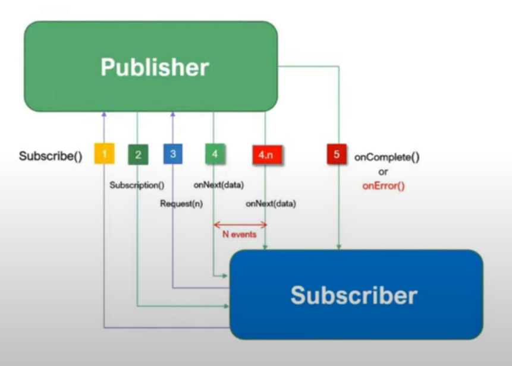

# Reactive programming

See https://www.youtube.com/watch?v=y3ySZkSgWik

In reactive programming there is a publisher and a subscriber.
The publisher generates data, the subscriber uses data



For documentation on react see https://projectreactor.io/

In reactive programming there are two main classes:
- Mono
- Flux

## Mono

### Basic

```java
package com.bsoft.reactive;

import reactor.core.publisher.Mono;

public class ReactiveTutorial {

    private Mono<String> testMono() {  // This is the publisher
        return Mono.just("Java"); // wrap the string in Mono
    }

    public static void main(String[] args) {
        ReactiveTutorial reactiveTutorial = new ReactiveTutorial();

        reactiveTutorial.testMono()
                .subscribe(data -> System.out.println(data));
    }
}

```
After running the output is
```text
7:50:23 PM: Executing ':com.bsoft.reactive.ReactiveTutorial.main()'…

> Task :compileJava UP-TO-DATE
> Task :processResources UP-TO-DATE
> Task :classes UP-TO-DATE

> Task :com.bsoft.reactive.ReactiveTutorial.main()
Java

BUILD SUCCESSFUL in 904ms
3 actionable tasks: 1 executed, 2 up-to-date
7:50:24 PM: Execution finished ':com.bsoft.reactive.ReactiveTutorial.main()'.
```

### Using log

To verify the flow in the program use .log()

```java
package com.bsoft.reactive;

import reactor.core.publisher.Mono;

public class ReactiveTutorial {

    private Mono<String> testMono() {  // This is the publisher
        return Mono.just("Java")
                .log(); // wrap the string in Mono
    }

    public static void main(String[] args) {
        ReactiveTutorial reactiveTutorial = new ReactiveTutorial();

        reactiveTutorial.testMono()
                .subscribe(data -> System.out.println(data));
    }
}
```

```text
> Task :processResources UP-TO-DATE
> Task :classes

> Task :com.bsoft.reactive.ReactiveTutorial.main()
19:53:34.120 [main] INFO reactor.Mono.Just.1 -- | onSubscribe([Synchronous Fuseable] Operators.ScalarSubscription)
19:53:34.123 [main] INFO reactor.Mono.Just.1 -- | request(unbounded)
19:53:34.123 [main] INFO reactor.Mono.Just.1 -- | onNext(Java)
Java
19:53:34.123 [main] INFO reactor.Mono.Just.1 -- | onComplete()

BUILD SUCCESSFUL in 584ms
3 actionable tasks: 2 executed, 1 up-to-date
7:53:34 PM: Execution finished ':com.bsoft.reactive.ReactiveTutorial.main()'.

```

Mono.just() will not accept an empty value instead use Mono.justOrEmpty() or Mono.empty().

# Git

```bash
# Create and switch to feature branch (if not already on one)
git checkout -b feature/reactive-improvements

# Commit your changes
git add .
git commit -m "Add reactive Spring Boot improvements"

# Push the feature branch
git push origin feature/reactive-improvements

# Create a tag for this feature
git tag -a v1.0-reactive-feature -m "Reactive Spring Boot feature implementation"

# Push the tag
git push origin v1.0-reactive-feature
```

```bash
git checkout -b step-01
git add .
git commit -m "step-01"
git push origin step-01
git tag -a vstep-01 -m "step-01 Mono"
git push origin vstep-01
```